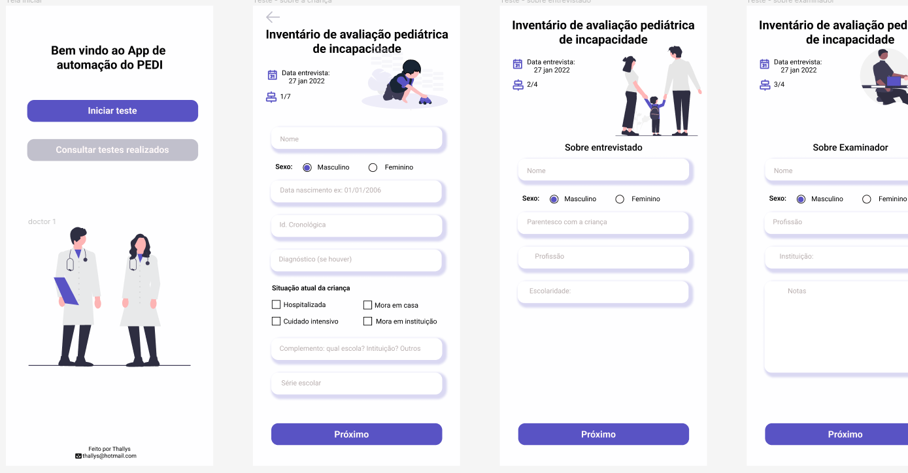

# RelApp

</h1>

 App para aplicação de teste de inventário de avaliação pediátrica de incapacidade.

<h1 align="center">
  
</h1>

### Pré-requisitos

Antes de começar, você vai precisar ter instalado em sua máquina as seguintes ferramentas:
[Git](https://git-scm.com), [Node.js](https://nodejs.org/en/), [React Native](https://reactnative.dev"), [Expo](https://expo.io/) . 
Além disto é aconselhável o editor para trabalhar com o código como [VSCode](https://code.visualstudio.com/)

### 🛠 Tecnologias

As seguintes ferramentas foram usadas na construção do projeto:

- [Expo](https://expo.io/)
- [Node.js](https://nodejs.org/en/)
- [React Native](https://reactnative.dev/)
- [TypeScript](https://www.typescriptlang.org/)
- [Watermelon](https://watermelondb.dev/Advanced/Sync.html)

## Autor
  Thallys Freitas   
  Entre em contato comigo:  |

